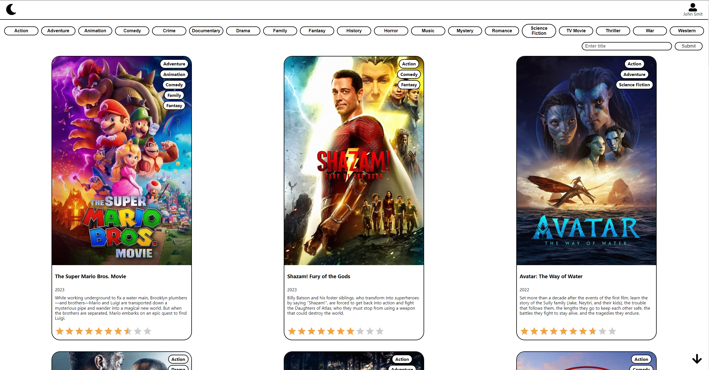
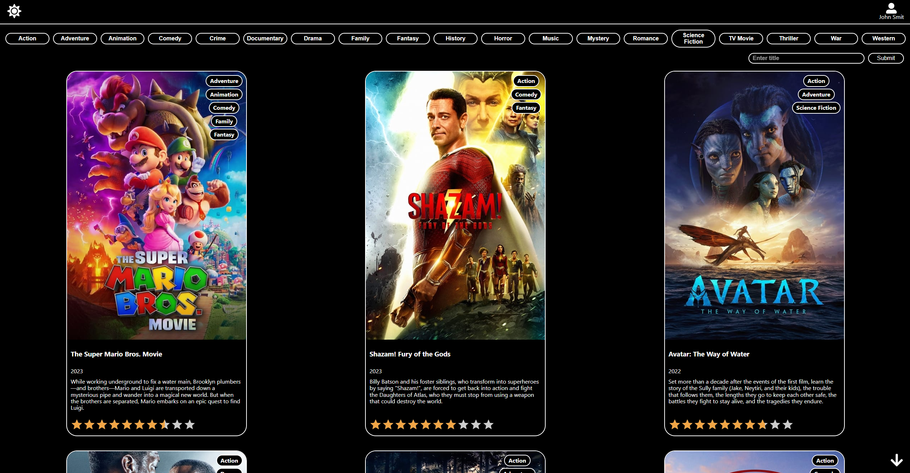
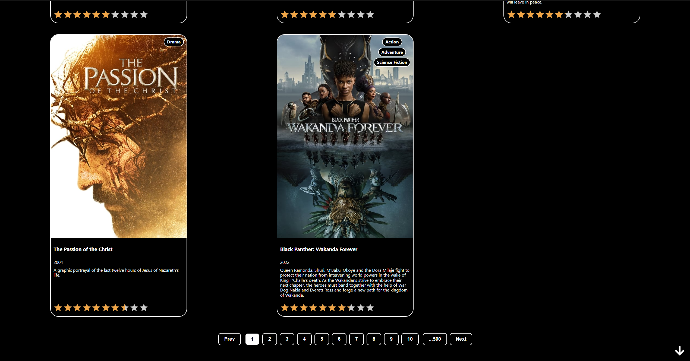
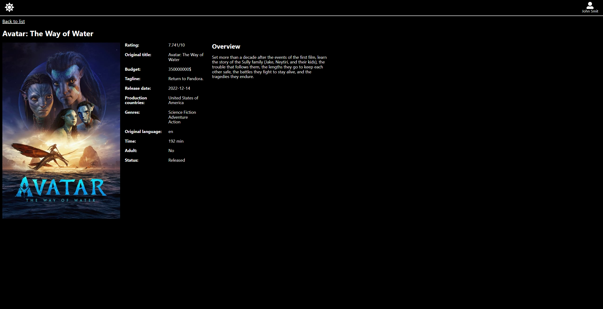

# Movie catalog

___

React single page application where you can find any movie and read basic information about it.

## Stack Technologies

- React
- Redux
- Axios
- Scss
- Api: themoviedb

## Screenshots

## Installation

`git clone https://github.com/OleksiiObabko/Movie-catalog`

Run `npm install`

## Usage

Run `npm start`

Open [http://localhost:3000](http://localhost:3000/Movie-catalog) in browser
